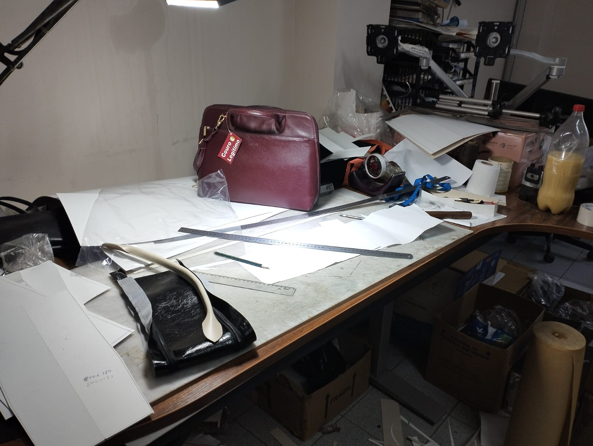
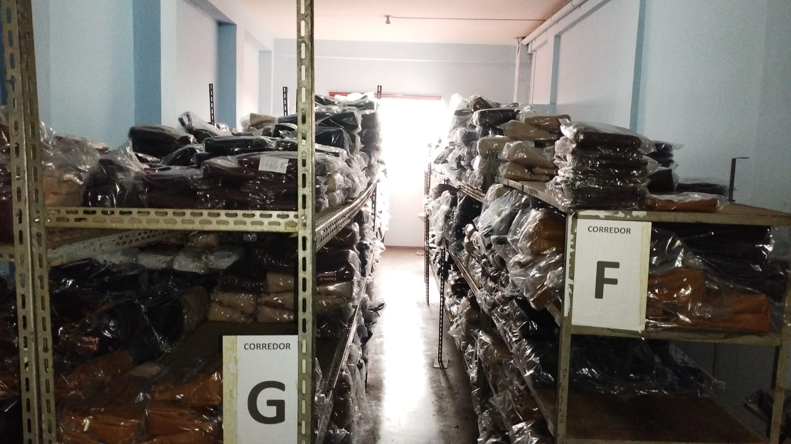
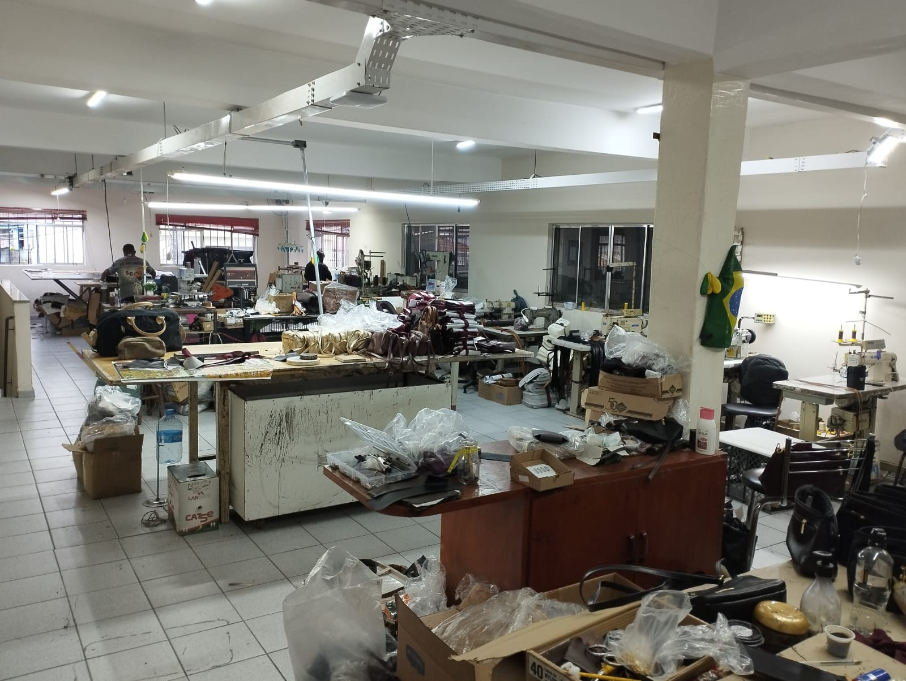
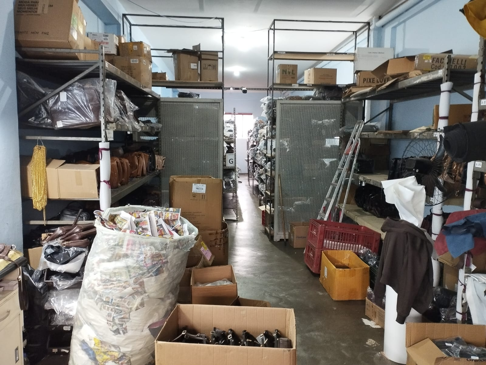
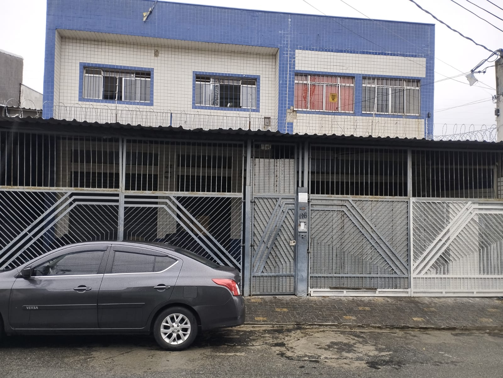

## Metadados

| Nome | RGM |
|---|---|
| Guilherme da Silva Ferreira Batista | 47302518 |
| Guilherme Petrucelli Domingos | 47270161 |
| Jaime Luiz de Oliveira Neto | 47336951 |
| Matheus Montagner | 47209470 |
| Vinicius Marques de Melo | 47213426 |

---

## 1. Caracterização da Organização

- **Nome e natureza da organização:**  Contrasti Bolsas e Acessórios Ltda - Fabricação de Bolsas. O questionário usado como base trata de uma "Indústria e Comércio de Bolsas de Couro" — uma empresa com fins lucrativos que fabrica e vende bolsas de couro (produção própria + venda direta e por canais diversos).
- **Contexto e porte:** com fins lucrativos; opera simultaneamente como indústria e comércio (venda em loja física, e-commerce, WhatsApp e representantes externos). O uso de facções terceirizadas e o controle de aproveitamento de couro por corte sugerem uma operação de pequeno a médio porte, com produção sob encomenda/lote (não em larga escala industrial). Volume médio de pedidos por mês entre 50 a 70, aumentando nas datas comemorativas (Dia das Mães e Natal).
- **Problemas e necessidades identificados:** o levantamento de requisitos aponta processos hoje prováveis de estarem descentralizados/manuais: controle de estoque de insumos (couro, ferragens, zíperes) sem rastreabilidade de lote; ausência de regra formal de crédito para vendas a prazo; cálculo de custo/preço de venda não padronizado (ficha técnica); acompanhamento de produção sem visibilidade de status; e falta de integração entre vendas, estoque e financeiro (títulos a pagar/receber gerados manualmente).
- **Justificativa da escolha:** Uma empresa que a gente sabia que ia ter acesso fácil e que consideramos de porte médio, não deixando nem tão simples e nem tão complicado o nosso trabalho.
- **Evidências da organização:** Endereço: Rua Alpiste, 116 - Jd. Eliane - São Paulo - SP. Contato na empresa: Osmar Lingiard, telefone para contato: 11 97334-4846, email: osmar@specia.com.br.

  
  
  

  
  
  

*Da esquerda para a direita, de cima para baixo: bancada de produção (corte/costura), Jaime no escritório, estoque de bolsas prontas (corredor G), oficina com as máquinas de costura, estoque de insumos/materiais, fachada na Rua Alpiste.

## 2. Processos de Negócio

**Principais processos mapeados** (extraídos do levantamento de requisitos, um por bloco do questionário):

1. **Cadastro e gestão de clientes** — cadastro com múltiplos endereços, perfil de preço (varejo/atacado) e aprovação de crédito.
2. **Cadastro e gestão de fornecedores** — dados do fornecedor, categoria de insumo e histórico de compras/avaliação.
3. **Ficha técnica e cadastro de produtos** — modelo → variação (SKU) → lista de materiais (BOM) com cálculo de custo.
4. **Gestão de estoque e compras** — entrada de insumo (XML de NF-e ou manual), controle por unidade de medida, estoque mínimo e baixa automática.
5. **Ordem de produção e chão de fábrica** — abertura de OP, execução por etapa (Modelagem → Corte → Preparação/Colagem → Costura → Montagem/Ferragens → Acabamento/Revisão → Embalagem), com Kanban e controle de aproveitamento de couro.
6. **Vendas, pedidos e faturamento** — pedido multicanal, forma de pagamento, comissão e emissão de NF-e/NFC-e.
7. **Expedição e pós-venda** — picking & packing, integração logística e garantia (RMA).
8. **Gestão financeira e relatórios gerenciais** — Contas a Pagar/Receber automáticos e indicadores (Curva ABC, DRE, fluxo de caixa).

---

## 3. Requisitos do Sistema

### 3.1 Requisitos Funcionais

| # | O sistema deve permitir... |
|---|---|
| RF01 | Cadastrar clientes com razão social/nome, CNPJ/CPF, inscrição estadual (quando lojista), e-mail para NF-e, telefone/WhatsApp e comprador responsável. |
| RF02 | Registrar múltiplos endereços por cliente (matriz, entrega, cobrança). |
| RF03 | Diferenciar clientes por perfil (Varejo Final × Atacado/Lojista) com regras de preço distintas. |
| RF04 | Consultar restrição de CPF/CNPJ e aplicar limite de crédito para boleto, exigindo aprovação financeira para novos lojistas. |
| RF05 | Cadastrar fornecedores com categoria de insumo, contato do vendedor e prazo médio de entrega. |
| RF06 | Registrar entrada de insumos por lote, vinculando fornecedor, cor/tonalidade e preço pago (rastreabilidade). |
| RF07 | Manter histórico de compras e avaliação por fornecedor (preço, variação, pontualidade de entrega). |
| RF08 | Cadastrar produtos por modelo e variação (SKU), combinando cor, tipo de couro e tipo de ferragem. |
| RF09 | Manter a Ficha Técnica (BOM) de cada SKU, com a quantidade de cada insumo necessária. |
| RF10 | Calcular automaticamente o custo total e sugerir preço de venda a partir da Ficha Técnica, mão de obra e markup. |
| RF11 | Registrar entrada de matéria-prima via XML de NF-e ou digitação manual. |
| RF12 | Controlar o estoque de insumos nas unidades apropriadas (dm²/m², unidade/metro, kg/L), com estoque mínimo e alerta automático. |
| RF13 | Baixar automaticamente o estoque de insumos na abertura da Ordem de Produção. |
| RF14 | Abrir Ordens de Produção vinculadas a um SKU e acompanhar o status em painel Kanban (Aguardando/Em Corte/Em Costura/Finalizado). |
| RF15 | Registrar, por etapa de produção, o artesão/facção responsável e o percentual de aproveitamento/perda de couro na etapa de Corte. |
| RF16 | Registrar pedidos de venda por canal (loja física, e-commerce, WhatsApp, representante), com forma de pagamento e parcelamento. |
| RF17 | Calcular comissão de vendedores/representantes sobre pedidos faturados, com percentuais diferenciados por canal. |
| RF18 | Emitir NF-e (venda mercantil) e NFC-e (cupom varejo), nativamente ou por integração. |
| RF19 | Controlar separação, conferência (código de barras) e embalagem (checklist + dust bag) antes do envio. |
| RF20 | Integrar com serviços de logística (Correios, Melhor Envio, transportadoras parceiras) para etiquetas e rastreio. |
| RF21 | Registrar trocas, devoluções e garantias (RMA) vinculadas ao item efetivamente entregue. |
| RF22 | Gerar lançamentos automáticos de Contas a Receber (vendas faturadas) e Contas a Pagar (compras). |
| RF23 | Gerar relatórios gerenciais: Curva ABC, margem de lucro por modelo, DRE gerencial, fluxo de caixa previsto × realizado, estoque parado. |
| RF24 | Restringir o acesso por perfil de usuário (Vendedor, Gerente de Produção, Financeiro, Administrador). |

### 3.2 Requisitos Não Funcionais

| # | Característica de qualidade |
|---|---|
| RNF01 | **Desempenho:** consultas de estoque e ficha técnica devem responder rápido o suficiente para não atrasar a abertura de uma Ordem de Produção. |
| RNF02 | **Segurança:** controle de acesso por perfil (RF24) e proteção de dados pessoais de clientes/fornecedores (LGPD). |
| RNF03 | **Disponibilidade:** o módulo de estoque/OP precisa estar disponível no horário de produção, já que a baixa de insumo é automática e bloqueante. |
| RNF04 | **Usabilidade:** o painel Kanban de produção deve ser operável pelos artesãos/facções sem treinamento extenso. |
| RNF05 | **Integridade transacional:** baixa de estoque, geração de título financeiro e emissão de nota fiscal devem ocorrer de forma atômica (tudo ou nada). |
| RNF06 | **Auditabilidade:** histórico de preços por fornecedor e de status de OP deve ser preservado para consultas gerenciais futuras. |

---

## 4. Regras de Negócio

- **Regras operacionais:**
  - Inscrição Estadual só é obrigatória quando o perfil do cliente é Atacado/Lojista.
  - Toda variação de produto (SKU) pertence a exatamente um modelo; um modelo pode ter uma ou várias variações.
  - A baixa de estoque de insumo ocorre automaticamente na abertura da Ordem de Produção (reserva de material necessário).
  - Todo insumo recebido é registrado com lote e fornecedor de origem, para garantir rastreabilidade de cor/textura entre peças da mesma coleção.
  - Comissão padrão de vendedor é de 5% sobre pedidos faturados, com percentual diferenciado entre canal de atacado e varejo.
  - Um chamado de garantia (RMA) está sempre associado a um item de pedido específico, nunca ao pedido inteiro.
  - Um pedido só é expedido depois de checklist de saída e conferência dos itens (leitura de código de barras).

- **Restrições organizacionais:**
  - Exigência legal de emissão de NF-e (venda mercantil) ou NFC-e (cupom fiscal varejo), conforme o canal de venda.
  - Dados pessoais de clientes e fornecedores (nome, CPF/CNPJ, contato) exigem tratamento conforme a LGPD.
  - O prazo médio de entrega de cada fornecedor impacta diretamente o planejamento da produção (lead time de insumo).
  - O pagamento de artesãos/facções terceirizadas depende do registro fiel de qual etapa cada um executou — sem esse registro não há como calcular a remuneração por produção.

---

## 5. Dicionário de Dados Conceitual (Preliminar)

> Formato oficial da disciplina: por entidade, `Atributo | Descrição | Regra de negócio associada`. As 9 entidades abaixo correspondem ao DER atual (`Diagrama/Diagrama.png`): fornecedor → insumo → ficha técnica → produto (bolsa/acessório) → item de pedido → pedido → cliente. Diferente de um DER conceitual "puro", este diagrama identifica explicitamente as chaves estrangeiras (marcadas "(FK)"), convenção que o grupo adotou para deixar visível, já nesta etapa, quais atributos vão virar FK no modelo lógico.

### FORNECEDOR
| Atributo | Descrição | Regra de negócio associada |
|---|---|---|
| id_fornecedor | Identificador | Chave primária, gerada pelo sistema. |
| nome | Nome do fornecedor | Obrigatório. |
| cnpj | CNPJ | Obrigatório e único. Dado protegido pela LGPD. |
| telefone | Telefone | Contato direto com o fornecedor. |
| email | E-mail comercial | Canal de contato comercial com o fornecedor. |
| endereco | Endereço | Endereço comercial do fornecedor. |
| data_cadastro | Data de cadastro | Preenchida automaticamente na criação do registro. |
| categoria_fornecedor | Categoria do fornecedor | Classifica o tipo de insumo que o fornecedor costuma vender (ex.: couro, ferragens, zíperes, embalagens). |

### INSUMO
| Atributo | Descrição | Regra de negócio associada |
|---|---|---|
| id_insumo | Identificador | Chave primária, gerada pelo sistema. |
| nome_insumo | Nome do material | Obrigatório. Exemplos: couro bovino caramelo, zíper, fivela, forro. |
| tipo_insumo | Grupo do material | Classifica o insumo (couro, ferragem, zíper, embalagem). |
| unidade_medida | Unidade de controle | Obrigatória (dm², m², unidade, metro, kg ou litro). |
| estoque_atual | Saldo em estoque | Nunca pode ser negativo. |
| preco_unitario | Preço por unidade de medida | Custo de referência do insumo. |

### FICHA_TÉCNICA *(entidade associativa — chave composta PRODUTO + INSUMO)*
| Atributo | Descrição | Regra de negócio associada |
|---|---|---|
| produto_id | Produto ao qual a linha pertence | Chave primária composta + chave estrangeira → PRODUTO. |
| insumo_id | Insumo utilizado nessa linha | Chave primária composta + chave estrangeira → INSUMO. |
| quantidade_necessaria | Quantidade por peça | Deve ser maior que zero e seguir a unidade_medida do insumo. |

### PRODUTO *(supertipo)*
| Atributo | Descrição | Regra de negócio associada |
|---|---|---|
| id_produto | Identificador | Chave primária, gerada pelo sistema. Mesma chave usada por BOLSA e ACESSÓRIO. |
| nome | Nome do produto | Obrigatório. Exemplo: Bolsa Tote. |
| descricao | Descrição do produto | Texto livre com detalhes do modelo. |
| preco_base | Preço base de venda | Valor de referência para a venda do produto. |
| categoria | Categoria do produto | Classificação comercial (linha, coleção ou departamento). |
| estoque_total | Saldo de produtos prontos | Quantidade disponível para venda. |

### BOLSA *(subtipo de PRODUTO)*
| Atributo | Descrição | Regra de negócio associada |
|---|---|---|
| id_bolsa | Identificador | Mesmo valor de id_produto do PRODUTO correspondente. |
| material | Material principal | Obrigatório para bolsa. |
| cor | Cor da bolsa | Obrigatória para bolsa. |
| tamanho | Dimensão da bolsa | Obrigatório para bolsa. |
| tipo_alca | Tipo de alça | Obrigatório para bolsa. |

### ACESSÓRIO *(subtipo de PRODUTO)*
| Atributo | Descrição | Regra de negócio associada |
|---|---|---|
| id_acessorio | Identificador | Mesmo valor de id_produto do PRODUTO correspondente. |
| material | Material principal | Obrigatório para acessório. |
| cor | Cor do acessório | Obrigatória para acessório. |
| tipo_acessorio | Tipo do acessório | Obrigatório. Exemplos: cinto, porta-cartões. |
| compatibilidade | Compatibilidade com outros produtos | Opcional. |

### ITEM_PEDIDO *(entidade associativa — identificador próprio)*
| Atributo | Descrição | Regra de negócio associada |
|---|---|---|
| id_item_pedido | Identificador | Chave primária, gerada pelo sistema. |
| produto_id | Produto vendido | Chave estrangeira → PRODUTO. |
| pedido_id | Pedido ao qual o item pertence | Chave estrangeira → PEDIDO. |
| quantidade | Unidades vendidas | Número inteiro maior que zero. |
| preco_unitario | Preço aplicado na venda | Fica congelado no momento da venda. |
| subtotal | Total do item | quantidade × preco_unitario. |

### PEDIDO
| Atributo | Descrição | Regra de negócio associada |
|---|---|---|
| id_pedido | Identificador | Chave primária, gerada pelo sistema. |
| data_pedido | Data do pedido | Obrigatória. |
| status | Situação do pedido | Obrigatório (ex.: aberto, faturado, expedido). |
| valor_total | Total do pedido | Soma do subtotal de todos os itens. |
| forma_pagamento | Forma de pagamento | Aceita: PIX, Cartão ou Boleto. |
| observacoes | Observações do pedido | Opcional. |

### CLIENTE
| Atributo | Descrição | Regra de negócio associada |
|---|---|---|
| id_cliente | Identificador | Chave primária, gerada pelo sistema. |
| nome | Nome do cliente | Obrigatório. |
| cpf | CPF | Obrigatório e único. Dado protegido pela LGPD. |
| telefone | Telefone ou WhatsApp | Canal principal de contato. |
| email | E-mail | Comunicação e envio de comprovantes. |
| endereco | Endereço | Endereço de entrega e/ou cobrança. |
| data_cadastro | Data de cadastro | Preenchida automaticamente na criação do registro. |

---

## 6. Modelagem Conceitual (Entidades, Atributos, Relacionamentos)

- **Entidades reconhecidas (9 no total):** FORNECEDOR, INSUMO, FICHA_TÉCNICA, PRODUTO, BOLSA, ACESSÓRIO, ITEM_PEDIDO, PEDIDO e CLIENTE. Duas são **entidades associativas** (FICHA_TÉCNICA, ITEM_PEDIDO), e PRODUTO é um **supertipo** especializado em BOLSA e ACESSÓRIO.
- **Atributos e classificações:** detalhados por entidade na Seção 5. O diagrama marca explicitamente as chaves estrangeiras (`produto_id (FK)`, `insumo_id (FK)`, `pedido_id (FK)`) — uma antecipação deliberada do modelo lógico, diferente da notação conceitual estritamente pura.
- **Especialização PRODUTO → BOLSA / ACESSÓRIO:** total e disjunta (símbolo "TD" no diagrama) — todo produto é obrigatoriamente bolsa OU acessório, nunca os dois. BOLSA e ACESSÓRIO herdam todos os atributos de PRODUTO.
- **Relacionamentos pertinentes (6 no total, mais a especialização):**

| # | Entidade A | Card. A | Verbo | Card. B | Entidade B | Observação |
|---|---|---|---|---|---|---|
| 01 | FORNECEDOR | (1,1) | fornece | (0,N) | INSUMO | um fornecedor fornece vários insumos; cada insumo tem um único fornecedor |
| 02 | INSUMO | (1,1) | compõe | (0,N) | FICHA_TÉCNICA | cada linha da ficha técnica usa exatamente um insumo |
| 03 | FICHA_TÉCNICA | (0,N) | detalha | (1,1) | PRODUTO | cada linha detalha exatamente um produto; um produto tem uma linha por insumo |
| 04 | PRODUTO | (1,1) | integra | (0,N) | ITEM_PEDIDO | um produto pode integrar vários itens de pedido |
| 05 | ITEM_PEDIDO | (0,N) | pertence_a | (1,1) | PEDIDO | cada item pertence a exatamente um pedido |
| 06 | PEDIDO | (0,N) | é_efetuado_por | (1,1) | CLIENTE | cada pedido é efetuado por exatamente um cliente |

- **Restrições e políticas organizacionais aplicadas ao modelo:** a categoria do fornecedor orienta que tipo de insumo ele fornece; o preço de venda do item de pedido (`preco_unitario`) fica congelado no momento da venda, independente de mudanças futuras no `preco_base` do produto; todo produto precisa se especializar em bolsa ou acessório, nunca os dois.

---

## 7. Diagrama Entidade-Relacionamento (DER)

**Arquivos anexados:** `Diagrama/Diagrama.png` (imagem) e `Dicionario_de_Dados.html` (dicionário completo, mesmo conteúdo da Seção 5).

O diagrama segue a notação de Chen: entidades como **retângulos**, relacionamentos como **losangos** rotulados com o verbo, atributos como **elipses**, com a **chave primária em elipse de contorno destacado (azul)**. Diferente de um DER conceitual estritamente puro, este diagrama marca explicitamente as **chaves estrangeiras** dentro da entidade (ex.: `produto_id (FK)` em ITEM_PEDIDO) — convenção documentada na própria legenda do diagrama. A especialização PRODUTO → BOLSA/ACESSÓRIO usa o triângulo "TD" (Total e Disjunta). As cardinalidades (mín,máx) ficam junto de cada ponta da linha, exatamente como na tabela da Seção 6.

Este recorte de 9 entidades prioriza o núcleo de custo e venda (o que é preciso para cadastrar, produzir e vender uma peça) e deixou de fora, nesta etapa, os módulos de produção detalhada (ordem de produção, etapas, artesãos), logística/pós-venda e financeiro descritos nas Seções 2 a 4 — que seguem documentados como requisito levantado, para uma modelagem futura.

---

## 8. Justificativa Técnica

- **Por que 9 entidades e não mais:** o grupo optou por modelar primeiro o núcleo que responde à pergunta "o que é preciso para produzir e vender uma peça" — fornecedor, insumo, ficha técnica e produto — mais o lado comercial mínimo — cliente, pedido, item de pedido. Módulos como ordem de produção e financeiro (Seções 2-4) ficaram fora deste DER por decisão de escopo, não por esquecimento.
- **Por que FICHA_TÉCNICA e ITEM_PEDIDO como entidades associativas:** ambas carregam atributos próprios (quantidade_necessaria; quantidade/preco_unitario/subtotal) que não pertencem a nenhuma das duas entidades que conectam — a notação exige reificá-los como entidade para acomodar esses atributos.
- **Por que PRODUTO como supertipo (BOLSA/ACESSORIO):** bolsa e acessório compartilham identificador, nome, descrição, preço base, categoria e estoque — mas cada um tem atributos exclusivos (tamanho/tipo_alça para bolsa; tipo_acessorio/compatibilidade para acessório). Generalização/especialização evita repetir os atributos comuns em duas entidades soltas e ainda documenta, no próprio diagrama, que um produto é sempre um dos dois (TD).
- **Por que marcar as FKs no diagrama conceitual:** o grupo optou por uma notação híbrida (conceitual + indicação de FK) para deixar mais claro, já nesta entrega, quais atributos migrarão como chave estrangeira no modelo lógico da Entrega 2 — uma antecipação deliberada, não um erro de camada.
- **Alternativas descartadas:** cogitou-se manter BOLSA e ACESSORIO como uma única entidade PRODUTO com campos opcionais — descartado porque misturaria atributos obrigatórios de um subtipo com atributos irrelevantes do outro.

---

## 9. Uso de Inteligência Artificial

| Item | Registro |
|---|---|
| **Ferramenta e etapa** | Claude (Claude Code / Sonnet 5, Anthropic) — usado em sete momentos: (1) leitura do questionário de requisitos e construção de um primeiro modelo conceitual (21 entidades) e dicionário de dados; (2) geração de um primeiro diagrama ER (notação "pé-de-galinha"); (3) preenchimento deste README a partir do esqueleto oficial da Entrega 1; (4) reconstrução desse primeiro diagrama na notação de Chen usada pelo BrModeloWeb, a pedido explícito do professor; (5) depois que o grupo (Guilherme) remodelou o DER para um recorte mais enxuto de 9 entidades direto no BrModeloWeb, reorganização do dicionário HTML já produzido pelo grupo e reescrita das Seções 5–8 para descrever esse modelo; (6) substituição do diagrama do repositório pela versão corrigida que o grupo enviou (PDF exportado do BrModeloWeb, com nomes de atributo, PKs/FKs e cardinalidades revisados), com o dicionário HTML e as Seções 5–8 atualizados para bater com essa versão; (7) a pedido do grupo, correção pontual de duas cardinalidades da própria imagem do diagrama ("compõe" e "detalha", ao redor de FICHA_TÉCNICA) para o padrão 1:N esperado de uma entidade associativa, e atualização do dicionário HTML e do README para refletir a correção. |
| **Motivação** | Acelerar a tradução do levantamento de requisitos para um modelo estruturado e para o formato de entrega exigido pela disciplina; depois, manter o README, o diagrama e o dicionário sempre consistentes entre si; por fim, corrigir duas cardinalidades que a própria IA havia sinalizado como pouco usuais, agora com autorização explícita do grupo. |
| **Prompt(s) utilizados** | "Preciso montar um diagrama e o dicionário desse diagrama, como se fosse no modelo BrModeloWeb..."; "Consegue gerar um arquivo pdf com esse arquivo que montou? Contendo somente o diagrama e o dicionário"; "Ajustar diagrama para o mesmo modelo de BrModeloWeb"; "adicione essas fotos no readme, na parte de evidências"; "De acordo com o dicionário e o diagrama que estão agora, crie o arquivo de dicionário de dados em html"; "Arrume o diagrama para esse pdf, agora ele está correto. No readme faça todas as correções necessárias, de acordo com esse diagrama novo e finalizado"; "Pode ajustar" (autorizando a correção das cardinalidades sinalizadas). |
| **Resposta recebida** | Um primeiro modelo (21 entidades); o DER redesenhado em notação de Chen; a troca do diagrama de 9 entidades pela versão corrigida enviada pelo grupo, com dicionário e README reescritos atributo a atributo; e, nesta última etapa, a edição direta dos pixels do PNG anexado — os dois números de cardinalidade trocados de lugar (o "N" ao lado de INSUMO virou "1"; o "1" ao lado de FICHA_TÉCNICA virou "N"), copiando o estilo exato de outros números já existentes no próprio diagrama (mesma fonte/cor/tamanho, sem redesenhar o diagrama do zero) — mais a atualização das duas linhas correspondentes no dicionário HTML e no README. |
| **Fontes consultadas e verificadas** | Nenhuma fonte externa. O modelo de 9 entidades corrigido veio do PDF que o próprio grupo exportou do BrModeloWeb e anexou à conversa; todos os nomes de atributo, PKs, FKs e cardinalidades desta versão do README foram conferidos diretamente nessa imagem, célula a célula. A correção de cardinalidade partiu de uma constatação técnica (padrão 1:N esperado para entidade associativa com chave composta), não de uma fonte externa. |
| **Trechos rejeitados ou corrigidos** | A primeira versão do diagrama (pé-de-galinha) foi descartada e refeita em Chen a pedido do professor. Depois, o modelo de 21 entidades foi substituído pelo modelo de 9 entidades que o grupo passou a usar, e a primeira tentativa desse modelo (com nome_modelo/markup/custo_materia_prima/preco_tabela em PRODUTO) foi substituída pela versão corrigida enviada pelo grupo. Nessa versão corrigida, os relacionamentos "compõe" (INSUMO–FICHA_TÉCNICA) e "detalha" (FICHA_TÉCNICA–PRODUTO) tinham sido desenhados como N:N e 1:1 — cardinalidades pouco usuais para uma entidade associativa com chave composta (produto_id + insumo_id), onde o padrão esperado é 1:N dos dois lados. A IA havia sinalizado isso sem alterar, por não ser uma decisão dela; com a autorização do grupo ("Pode ajustar"), a IA corrigiu para INSUMO (1,1)–FICHA_TÉCNICA (0,N) e FICHA_TÉCNICA (0,N)–PRODUTO (1,1), tanto na imagem do diagrama quanto no dicionário e no README. |
| **Justificativa da escolha final** | As Seções 5–8 e o dicionário HTML agora descrevem exatamente o que está anexado em `Diagrama/Diagrama.png`, atributo por atributo, PK/FK e cardinalidade — incluindo a correção de "compõe"/"detalha" para o padrão 1:N, que é o que o grupo pediu para ajustar. As Seções 1–4 (requisitos e regras de negócio) não foram alteradas nesta etapa. |
| **Reflexão crítica** | O modelo reflete fielmente o texto do questionário, mas não substitui a pesquisa de campo exigida pela atividade — regras de negócio reais da organização escolhida podem divergir do que está aqui (valores de limite de crédito, percentuais de comissão etc. foram tratados como exemplos/referências, não como regras fixas). O grupo deve validar cada regra de negócio da Seção 4 com a organização real antes de assumi-las como definitivas. |

---

